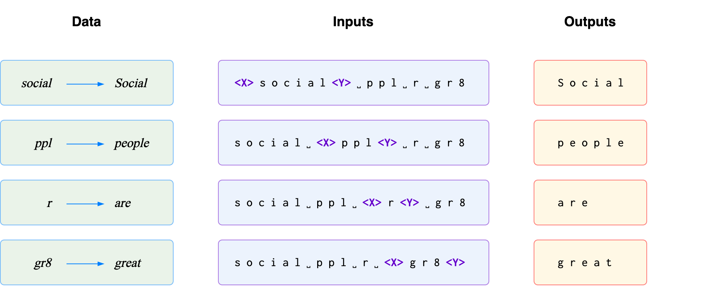

<h2 align="center"><b><h3>ÚFAL at MultiLexNorm 2021:</h3>Improving Multilingual Lexical Normalization by Fine-tuning ByT5</b></h2><br>


<p align="center">
  <b>David Samuel & Milan Straka</b>
</p>

<p align="center">
  <i>
    Charles University<br>
    Faculty of Mathematics and Physics<br>
    Institute of Formal and Applied Linguistics
  </i>
</p>
<br>

<p align="center">
  <a href="TODO"><b>Paper (TODO)</b></a><br>
  <a href="https://colab.research.google.com/drive/1rxpI8IlKk-D2crFqi2hdzbTBIezqgsCg?usp=sharing"><b>Interactive demo on Google Colab</b></a><br>
  <a href="TODO"><b>HuggingFace models (TODO)</b></a>
</p>

<p align="center">
    
</p>

_______

<br>

This is the official repository for the winning entry to the [*W-NUT 2021: Multilingual Lexical Normalization (MultiLexNorm)* shared task](https://noisy-text.github.io/2021/multi-lexnorm.html), which evaluates lexical-normalization systems on 12 social media datasets in 11 languages.

Our system is based on [ByT5](https://arxiv.org/abs/2105.13626), which we first pre-train on synthetic data and then fine-tune on authentic normalization data. It achieves the best performance by a wide margin in intrinsic evaluation, and also the best performance in extrinsic evaluation through dependency parsing. In addition to these source files, we also release the fine-tuned models on [HuggingFace (TODO)](TODO) and an interactive demo on [Google Colab](https://colab.research.google.com/drive/1rxpI8IlKk-D2crFqi2hdzbTBIezqgsCg?usp=sharing).

_______

<br>

## How to run

### :feet: &nbsp; Clone repository and install the Python requirements

```sh
git clone https://github.com/ufal/multilexnorm2021.git
cd multilexnorm2021

pip3 install -r requirements.txt 
```

### :feet: &nbsp; Initialize

Run the inialization script to download the official MultiLexNorm data together with a dump of English Wikipedia. We recommend downloading [Wikipidia dumps](https://dumps.wikimedia.org/backup-index.html) to get clean multi-lingual data, but other data sources should also work.

```sh
./initialize.sh
```

### :feet: &nbsp; Train

To train a model for English lexical normalization, simply run the following script.  Other configurations are located in the `config` folder.
```sh
python3 train.py --config config/en.yaml
```

_______

<br>

## Cite us :pleading_face::point_right::point_left:

```
TODO
```
